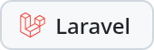
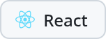
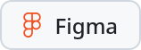

### Projects

  <a href="https://halfspacefootball.app"><picture><source media="(prefers-color-scheme: dark)" srcset="assets/halfspace-dark.png"></picture></a>
  <a href="https://kitebeachforecast.vercel.app"><picture><source media="(prefers-color-scheme: dark)" srcset="assets/kite-beach-forecast-dark.png"></picture></a>
  <a href="https://mikaelrothig.com/"><picture><source media="(prefers-color-scheme: dark)" srcset="assets/website-dark.png"></picture></a>

### Tech stack

  <picture><source media="(prefers-color-scheme: dark)" srcset="assets/stack/php-dark.png"></picture>
  <picture><source media="(prefers-color-scheme: dark)" srcset="assets/stack/laravel-dark.png"></picture>
  <picture><source media="(prefers-color-scheme: dark)" srcset="assets/stack/postgresql-dark.png"></picture>
  <picture><source media="(prefers-color-scheme: dark)" srcset="assets/stack/typescript-dark.png"></picture>
  <picture><source media="(prefers-color-scheme: dark)" srcset="assets/stack/react-dark.png"></picture>
  <picture><source media="(prefers-color-scheme: dark)" srcset="assets/stack/vue-dark.png"></picture>
  <picture><source media="(prefers-color-scheme: dark)" srcset="assets/stack/astro-dark.png"></picture>
  <picture><source media="(prefers-color-scheme: dark)" srcset="assets/stack/html-dark.png"></picture>
  <picture><source media="(prefers-color-scheme: dark)" srcset="assets/stack/tailwindcss-dark.png"></picture>
  <picture><source media="(prefers-color-scheme: dark)" srcset="assets/stack/figma-dark.png"></picture>

